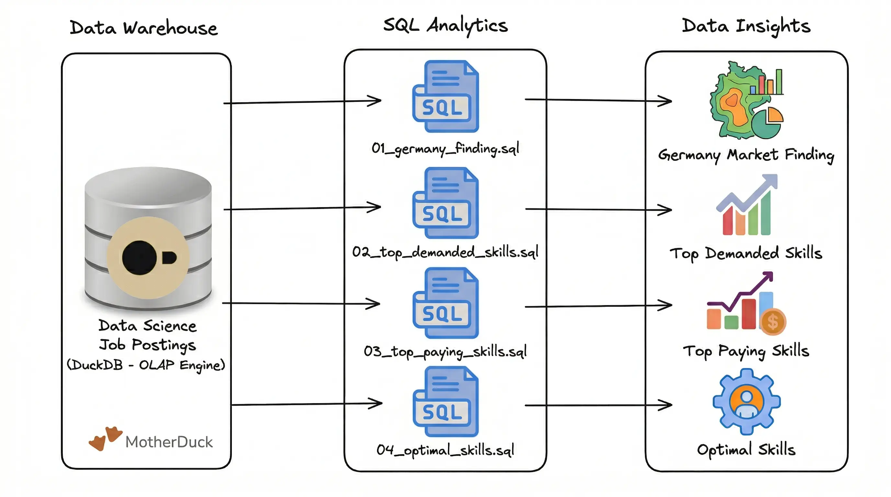

# 🚀SQL_EDA_Project (Data Engineering Skills & Salary Insights in Germany)


---
## 📸 Visual Overview


---
## 🧠 Project Overview

This project delivers a **data-driven analysis of the Data Engineering job market in Germany**, leveraging a large-scale job postings data warehouse.

It is designed to answer **high-impact, real-world questions** relevant to:

* Early-career data engineers
* Hiring trends
* Skill prioritization for maximum ROI

> ⚡ Built with a strong focus on **analytical depth, SQL mastery, and business insight generation** aligned with expectations at top-tier tech companies.

---

## 🎯 Key Business Questions

* What does the **entry-level (intern/working student)** market look like?
* Which skills are **most in-demand** for Data Engineers?
* Which skills **command the highest salaries**?
* What is the **optimal skill strategy** balancing demand and compensation?

---

## 🗄️ Dataset & Scope

* 🌍 Source: Enterprise-level **Data Warehouse** (global job postings)
* 🇩🇪 Focus: Germany
* 📅 Time Range: **Jan 2023 – Jun 2025**
* 📊 Volume: **51,000+ job postings analyzed**


---

## 🏗️ Repository Structure

```
📦 SQL_EDA_Project
 ┣ 📜 01_germany_finding.sql
 ┣ 📜 02_top_demanded_skills.sql
 ┣ 📜 03_top_paying_skills.sql
 ┣ 📜 04_optimal_skills.sql
 ┗ 📄 README.md
```

### 🔍 Analytical Modules

* 📌 [Germany Market Filtering](./01_germany_finding.sql)
  → Defines dataset scope, filters **intern/working student roles**, quantifies opportunity size

* 📌 [Demand Analysis](./02_top_demanded_skills.sql)
  → Identifies **top in-demand technologies** using job-skill joins

* 📌 [Compensation Analysis](./03_top_paying_skills.sql)
  → Computes **median salary per skill** + demand distribution

* 📌 [Optimization Model](./04_optimal_skills.sql)
  → Builds a **custom scoring model** combining demand (log-scaled) and salary

---

## 📊 Key Insights (Executive Summary)

### 1️⃣ Entry-Level Market Reality

* Only **~396 relevant roles** out of 51k+ postings
* → Indicates **high competition + low supply**

---

### 2️⃣ Core Skill Stack (High Demand)

* Python
* SQL
* AWS / Azure
* Git, Docker, Airflow

👉 These form the **baseline expectation**, not differentiation

---

### 3️⃣ Compensation Insights

* Core skills converge around **~€147K median salary**
* High demand ≠ higher pay
* Niche tools (GraphQL, FastAPI) → higher salary, lower demand

---

### 4️⃣ Optimal Skill Strategy (Key Insight)

Custom scoring model reveals:

🥇 SQL
🥈 Python
🥉 Spark, AWS, Azure

👉 **Insight:**

> The market rewards **foundational + scalable technologies**, not just niche specialization

---

## 🧠 Technical Highlights (SQL Depth)

This project demonstrates **production-level SQL capabilities**:

* 🔹 Multi-table joins (fact + dimension modeling)
* 🔹 Advanced filtering using **regex & text normalization**
* 🔹 Aggregations with business context (COUNT, MEDIAN)
* 🔹 Derived metrics & feature engineering
* 🔹 Logarithmic transformations for normalization
* 🔹 Custom ranking model (**analytical scoring system**)
* 🔹 Translating business problems → structured SQL solutions

---

## ⚙️ Analytical Approach

* Data modeling awareness (fact/dimension tables)
* Skill extraction via join relationships
* Demand quantification via frequency analysis
* Salary benchmarking using median (robust metric)
* Optimization using:

```
Optimal Score = ln(Demand) × Median Salary
```

👉 Balances **market demand + financial return**

---

## 💡 Why This Project Stands Out

* ✔️ Uses **real-world, large-scale dataset**
* ✔️ Moves beyond EDA → **decision intelligence**
* ✔️ Combines **engineering + analytics thinking**
* ✔️ Introduces **custom metric design (optimization model)**
* ✔️ Directly aligned with **data-driven product thinking**


---

## 🚀 Potential Extensions

* Build dashboard (Tableau / Power BI)
* Add time-series trend analysis
* Cross-country comparison
* Skill clustering / ML-based segmentation

---

## 👨‍💻 Author

**Your Name**
Aspiring Data Engineer | SQL | Data Analytics

---

## ⭐ Final Note

This project reflects the ability to:

* Work with **real-world messy data**
* Derive **actionable insights**
* Build **scalable analytical logic using SQL**

> 🎯 Skills demonstrated here are directly transferable to **data engineering and analytics roles at top tech companies**

---
